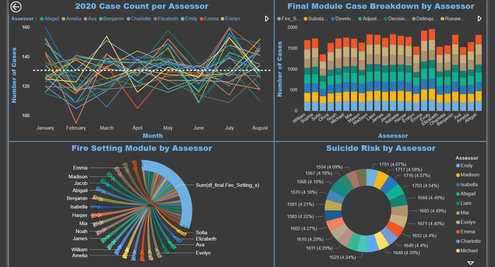
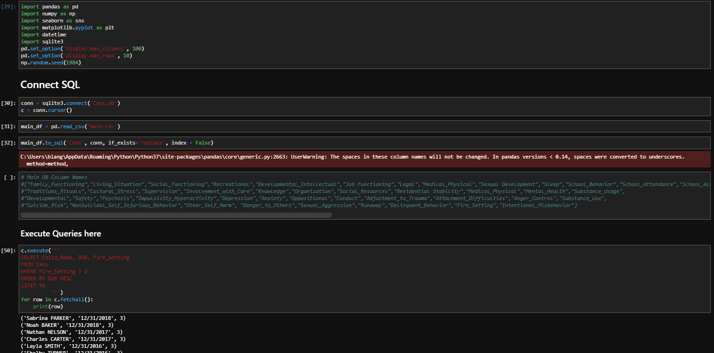

## Data Project for NU CANS :children_crossing:
---
### Project Authors: 
* Bryan Lange - [LinkedIn](https://www.linkedin.com/in/bryanrobertlange)
---
- The IDCFS CANS in its simplest form is a 139 item trauma-informed tool used to gather a wide breadth of information on the youth and families in the Illinois child welfare system
- I made up a dataset of around 25000 children and assigned them random scores to simulate cases and use this fake data to perform analysis 
- Modules were made to mimic the real CANS process and minors were added to respective modules and further assessed with random ratings 

 

 

